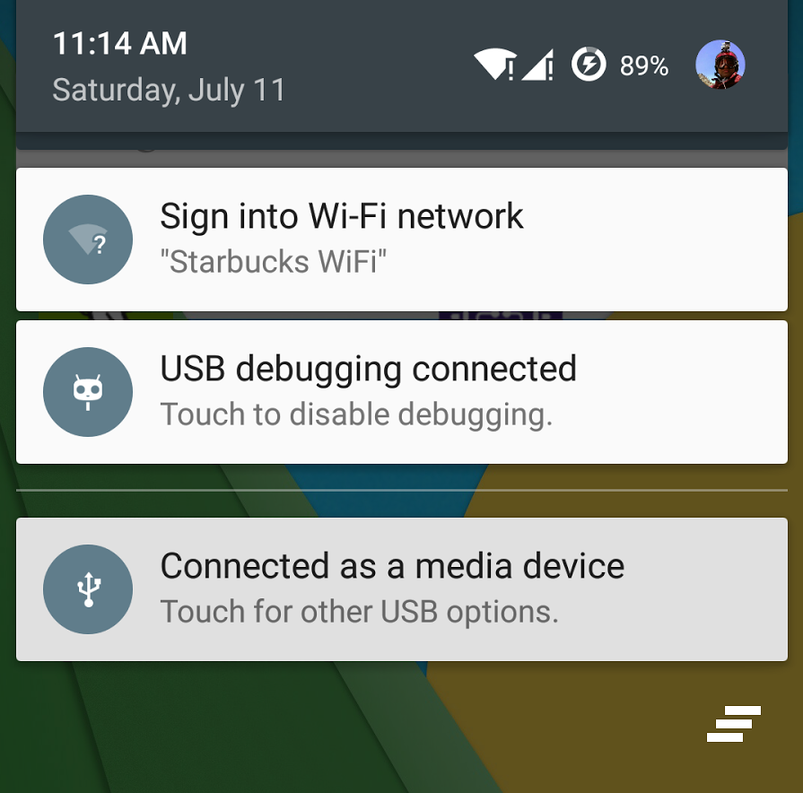
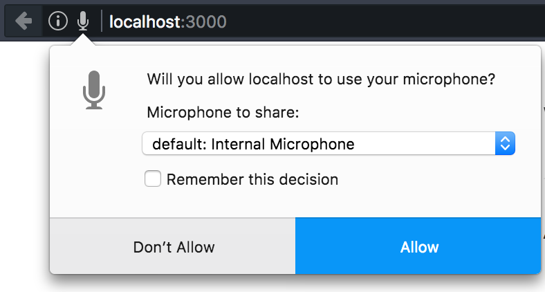
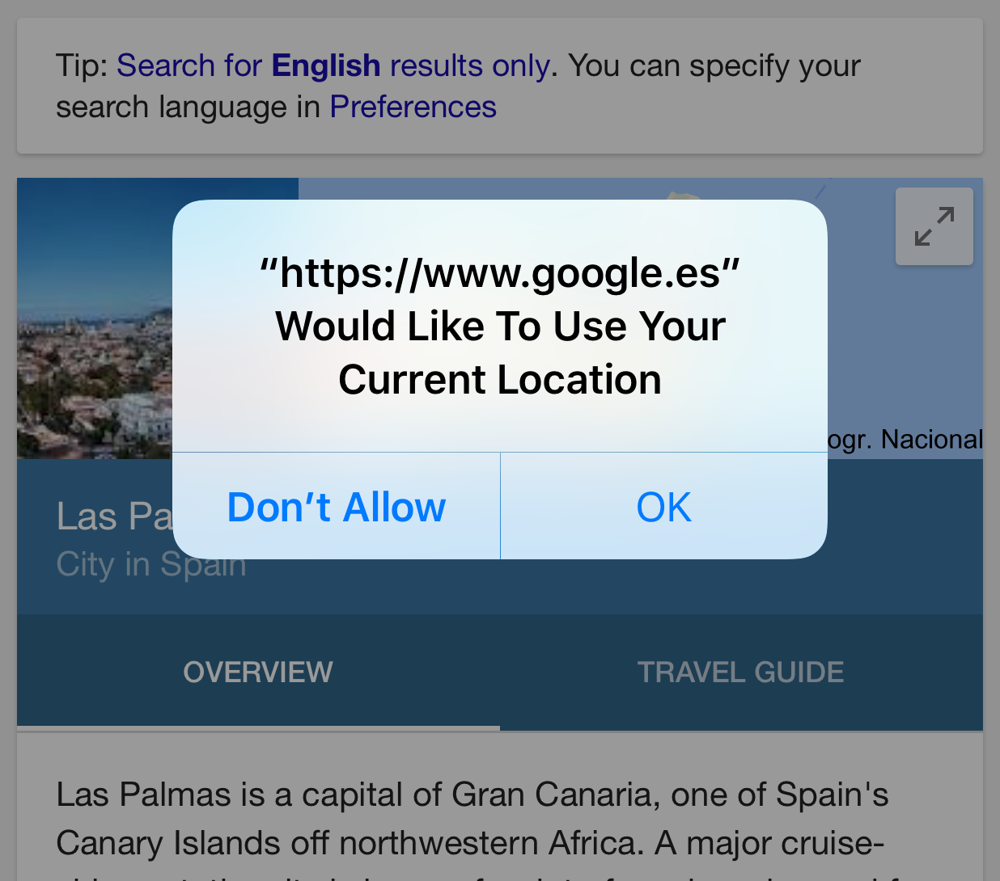
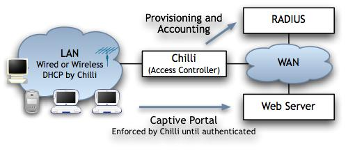
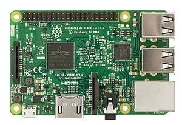
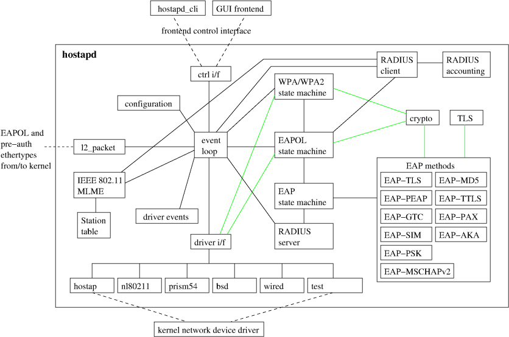
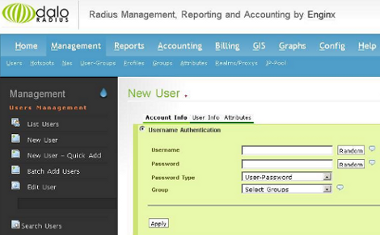

# Situación Actual de la Tecnología

Las tecnologías que facilitan la implementación de este Trabajo Fin de Grado, como la mayoría de tecnologías de computadores, se hallan en un proceso continuo de crecimiento prácticamente exponencial. La aparición de soluciones rápidas a problemas que antes solo podían salvarse con múltiples instalaciones, aplicaciones y otros rodeos son cada vez procesos más transparentes para los desarrolladores y el usuario final, especialmente en lo que concierne a la tecnología web, altamente reforzada gracias a la aparición y ubicuidad de los dispositivos móviles de alta conectividad y capacidad de procesamiento como teléfonos, tablets o incluso relojes inteligentes.

Asimismo, los avances en miniaturización que hicieron posible los dispositivos mencionados anteriormente ya habían permitido la aparición de *hardware* de bajo coste y consumo energético, versátiles y fácilmente orientables a propósitos específicos (con Arduino como ejemplo característico de código abierto) pero cada vez más capaces de servir como computadores de propósito general, como es el caso de la Raspberry Pi.

Con todos estos recursos y su constante incremento en posibilidades y mejoras a nuestra disposición se abre un espectro cada vez más amplio de posibilidades a la hora de interpretar servicios ya conocidos con funcionalidades nuevas, y es en este contexto en el que se desarrolla el presente Trabajo Fin de Grado, usando las siguientes tecnologías:

* Raspberry Pi 3

* Software de Punto de Acceso, de Portal Cautivo y AAA

* Tecnología Web (HTML+CSS+JS para frontend, Node.js y paquetes npm para backend, MediaStream Recording API como tecnología central)

# Definición del Problema

Este Trabajo Fin de Grado trata de acometer una doble problemática definida a continuación; una de ellas está relacionada con la monitorización de infraestructuras por parte del hipotético proveedor de un servicio de acceso a internet, mientras que la otra acomete la facilidad del acceso de los usuarios finales a dicho servicio.

## La Monitorización de Infraestructuras

Supongamos la existencia de una empresa que opere en infraestructuras físicas a las que se supone un elevado tránsito o alojamiento de personas, como aeropuertos u hoteles. Si estas empresas desearan monitorizar ciertos aspectos de sus recintos como niveles de ruido, temperatura, humedad, etc, habrían de adquirir, configurar y mantener el equipamiento dedicado a estos propósitos, con los correspondientes costes asociados a cada uno de estos aspectos que, dependiendo de la calidad deseada, pueden ser ciertamente elevados.

Por otra parte, estas empresas suelen tener el acceso inalámbrico a internet como parte de su carta de servicios a los clientes. Los despliegues de red utilizados para implementar estos accesos habitualmente cuentan con servicios de portal cautivo, que requieren de cierta operativa por parte del usuario que se conecta a la red a cambio de obtener finalmente dicho acceso. Esta operativa suele incluir la introducción de datos personales para crear una cuenta de usuario con la que hacer *login* en futuros accesos, la selección de publicidad que recibir en el correo electrónico o su visualización... en definitiva, acciones que luego serán utilizadas por la empresa para contacto comercial, potenciales clientes y otros procesos de marketing.

La solución propuesta en este Trabajo Fin de Grado trataría de aunar la necesidad de monitorización de infraestructuras de la empresa y el acceso a internet de sus usuarios, implementando un servicio de portal cautivo dotado de una aplicación web con la que se adquirirán datos de los sensores del dispositivo en lugar de la clásica introducción manual de datos o credenciales a cambio de la obtención del acceso a la red. El sensor que se ha escogido para la implementación de este TFG es el micrófono, presente en la práctica totalidad de los dispositivos actuales (ordenadores portátiles, *smart devices*, etc).

Este sensado colaborativo podría utilizarse para diversas estadísticas (evolución temporal, mapeos de niveles, etc) con los que la empresa podía obtener una realimentación con unos niveles mínimos de fiabilidad. Los datos recabados no tendrían la misma calidad que el sensado realizado por equipamiento específico de alto rendimiento, pero el coste sería menor y su mantenimiento y configuración más sencillos de realizar. Además, esta solución software tendría una alta escalabilidad y versatilidad de configuraciones, por ejemplo pudiendo permitir el acceso a internet a cambio de obtención de datos en intervalos regulares en los que el portal cautivo debe mantenerse abierto en alguna ventana o pestaña del navegador, cortándose el acceso si se cierra, o dando un tiempo de acceso fijo (*lease-time*) a cambio de una lectura puntual del sensor.

## El Acceso de Usuarios al Servicio

Como se ha mencionado en el apartado anterior, las soluciones de portal cautivo empleadas habitualmente requieren que el usuario del servicio introduzca manualmente ciertos datos personales o credenciales o que seleccione y visualice publicidad en procesos a menudo tediosos, repetitivos o confusos. El estilo de vida actual, en su búsqueda de la inmediatez, favorece y recompensa las soluciones en las que el usuario pierde el menor tiempo posible en el proceso de acceso al servicio.

Por ello, un servicio de portal cautivo que solo requiera del sensado del dispositivo solo precisaría de la obtención de los permisos pertinentes de acceso al hardware, ya implementados en los navegadores actuales en forma de *popups* sencillos con la opción de aceptar o declinar tal acceso (como los mostrados en las imágenes que acompañan a este apartado). De esta forma e incluso aunque el servicio de portal cautivo utilizado requiera de credenciales, la obtención de estos y el subsiguiente acceso a internet se hace de una forma mucho más transparente para el usuario, solo teniendo que aceptar y dar permiso a la aplicación web para llevar a cabo el procedimiento automáticamente.

# Propuesta de Solución

Una implementación que acometa la problemática anteriormente expuesta puede desarrollarse de diversas formas. En el caso de la que concierne a este Trabajo Fin de Grado, se ha optado por utilizar la siguiente. Las definiciones aportadas a continuación son superficiales, entrando en mayores detalles en el siguiente capítulo de este documento.

Se utilizará una Raspberry Pi 3 como elemento principal del diseño, pues allí estará instalado todo el *software* necesario para proporcionar el servicio. Se utiliza el modelo 3 porque es el primero que cuenta con módulo WiFi integrado en el dispositivo, a diferencia de modelos anteriores en los que había que instalar un módulo USB aparte. En el sistema operativo de la Raspberry Pi instalaremos las utilidades necesarias:

* **_Hostapd_**: Este *daemon* de linux se encarga de configurar el módulo WiFi en modo AP. De esta manera, la Raspberry Pi puede actuar como un punto de acceso configurable, conectándose sus clientes a través de su interfaz WiFi y obteniendo acceso a la red a través de la interfaz Ethernet de acuerdo al siguiente esquema.

[INSERTAR ESQUEMA RASPI-ROUTER-INTERNET]

* **CoovaChilli**: El software controlador de acceso que proporcionará IPs a las conexiones entrantes con su DHCP, redirigirá dichas conexiones al portal cautivo para su autenticación en el sistema y gestionará las mismas y la contabilidad del sistema por medio de un sistema de AAA que ha de ser instalado aparte, habitualmente un servidor RADIUS.

* **FreeRADIUS**: El servicio de AAA gracias al cual CoovaChilli controlará los usuarios del sistema. Para su utilización es necesaria su previa integración con MySQL, que ha de estar instalado en el sistema.

* **daloRADIUS**: Plataforma Web destinada a controlar el servidor RADIUS de forma gráfica. En este TFG, su contenido es proporcionado por el servidor web NGINX.

* **Node.js**: La tecnología JavaScript de servidor, complementada con paquetes *npm*, con la que implementaremos el *back-end* de nuestra aplicación web de portal cautivo, que interactuará con CoovaChilli por medio de su interfaz JSON.

* **_La página web que verán los clientes_**: El *front-end* de la aplicación web, servido por Node.js e implementado con sus tres grandes pilares: HTML, CSS y JavaScript. Esta página web es el principal elemento diferenciador respecto a otros portales cautivos habituales, dado que su propósito será el de recopilar del usuario, a través de su navegador, los datos del micrófono del dispositivo conectado al portal cautivo a través de su navegador. Esto es posible gracias a la API MediaStream Recording, tecnología estrechamente relacionada con WebRTC.

# Tecnologías Utilizadas

## Raspberry Pi

La Raspberry Pi es un tipo de sistema embebido de pequeño tamaño, un computador de placa única de dimensiones poco mayores a una tarjeta de crédito inicialmente planteado como un dispositivo de bajo precio y consumo energético, 35 dólares y 1.5 W respectivamente en su último modelo, orientado a propósitos educativos en colegios y países en vías de desarrollo, aunque su uso se extendió rápidamente a otros ámbitos como la robótica. Sus modelos son desarrollados por la Raspberry Pi Foundation en el Reino Unido y actualmente se le considera el ordenador de esa región más vendido.

Desde su introducción en Febrero de 2012 ha habido varias generaciones de este dispositivo, siendo la más reciente la Raspberry Pi 3 Model B que es la usada en este Trabajo Fin de Grado.

Este modelo consta de un sistema en chip (SoC) de Broadcom, que incluye una CPU quad-core compatible con ARMv8 a 64 bits que opera a una frecuencia de 1.2 GHz y una GPU. Cuenta también con 1GB de memoria RAM LPDDR2 a 900 MHz. Para almacenar el sistema operativo se utiliza una tarjeta MicroSDHC, y aunque puede instalarse una gran variedad de SOs diferentes el recomendado es un sistema operativo Linux basado en Debian, convenientemente bautizado como Raspbian. En cuanto a entrada-salida la Raspberry Pi 3 cuenta con cuatro puertos USB, interfaz Ethernet 10/100 Mbit/s y salidas HDMI y minijack de audio. También incorpora 40 pines entrada-salida de propósito general (GPIO) para operaciones a bajo nivel. Otro aspecto de importancia crucial para este Trabajo Fin de Grado es la conectividad inalámbrica, dado que la Raspberry Pi 3 incorpora chipsets Wi-Fi 802.11n para 2.4 GHz a 150 Mbit/s y Bluetooth 4.1 a 24 Mbits/s.

Además de esto, en la actualidad se fabrica una amplia gama de accesorios destinados a ampliar la funcionalidad de la Raspberry Pi como cámaras de vídeo, interfaces de control de LEDs y sensores y otras placas de expansión.

### Raspbian

Raspbian es el sistema operativo recomendado por la Raspberry Pi Foundation desde 2015. Está basado en Debian Jessie y fue desarrollado por Mike Thompson y Peter Green poniendo especial énfasis en los procesadores ARM de bajo rendimiento de la Raspberry Pi. Incluyen Python, Scratch, Java, Sonic Pi, Mathematica entre otros programas relevantes.

Utiliza PIXEL (Pi Improved Xwindows Environment Lightweight) como entorno gráfico de escritorio. Consiste en un entorno de escritorio LXDE modificado y el gestor de ventanas Openbox.

## hostapd

hostapd (Host Access Point Daemon) es una utilidad *software* cuya funcionalidad es transformar las interfaces de red en puntos de acceso y servidores de autenticación. Implementa la gestión de puntos de acceso IEEE 802.11, autenticación IEEE 802.11X/WPA/WPA2/EAP, cliente RADIUS, servidor EAP y servidor de autenticación RADIUS. Soporta interfaces con drivers presentes en sistemas Linux y FreeBSD.

Como *daemon* ha sido diseñado para operar en segundo plano como componente *back-end*, soportando aplicaciones *front-end* separadas. Ha sido programado para funcionar de forma modular por medio de ficheros C separados

hostapd se configura por medio de un fichero de texto que lista todos los parámetros de configuración, alojado en la ruta */etc/hostapd/hostapd.conf*, que cuenta con los siguientes atributos relevantes y comúnmente utilizados, entre otros:

* Atributos de Interfaz Inalámbrica:

    * *interface*: Indica a hostapd qué interfaz inalámbrica va a utilizarse.

    * *bridge*: Indica la interfaz puente si la interfaz inalámbrica es parte de ella.

    * *driver*: Controlador utilizado. En los sistemas modernos este suele fijarse en n18011

* Atributos de Entorno Inalámbrico:

    * *ssid*: El nombre o SSID (Service Set IDentifier) de la red que aparecerá en la lista de redes disponibles al hacer la habitual búsqueda de red desde un dispositivo inalámbrico.

    * *hw_mode*: Fija el modo de operación de la interfaz y los canales permitidos. Los valores permitidos dependen del hardware pero siempre son un subconjunto de a, b o g. Aunque se configure una red 802.11n no es aquí donde debe indicarse, ya que 802.11n opera sobre la funcionalidad de 802.11a o 8011.g

    * *channel*: El canal en el que hostapd operará el AP. Debe ser un canal soportado por el modo de hardware establecido en el atributo hw_mode. Los canales de 802.11 son de 20 MHz de anchura (4 canales) en el espectro, solapándose entre ellos, por lo que deben escogerse de forma que esto no suceda. Por ejemplo, si la mayoría de puntos de acceso de la red utilizan el canal 6 sería óptimo utilizar el canal 1 o el canal 11 para evitar interferencias por solapamiento.

* Atributos de 802.11n:

    * *ieee80211n*: Atributo booleano que al asignársele el valor 1 activa las funcionalidades propias de 802.11n.

    * *ht_capab*: Una lista de las capacidades 802.11n soportadas por el dispositivo utilizado. Actúan como *flags*, activándose al ser escritos entre corchetes. Ejemplos de ello serían habilitar el uso de canales de 40 MHz (*[HT40+]*) o activar el modo DSSS/CCK en dichos canales (*[DSSS_CCK-40]*).

* Autenticación y Encriptado:

    * *macaddr_acl*: Controla el filtrado de direcciones MAC.

    * *auth_algs*: Un campo de bits en el que el primero es para autenticación abierta, el segundo es por autenticación de Clave Compartida (WEP), pudiendo activar ambos introduciendo un 3.

    * *ignore_broadcast_ssid*: Activa o desactiva la difusión del SSID.

    * *wpa*: Un campo de bits como auth_algs. El primero activa WPA1, el segundo activa WPA2 y el 3 activa los dos.

    * *wpa_psk* o *wpa_passphrase*: La contraseña para la autenticación WPA.

    * *wpa_key_mgmt*: Controla con qué algoritmos de gestión de claves podrá autenticarse un cliente.

    * *wpa_pairwise*: Controla el encriptado de datos de WPA.

    * rsn_pairwise: Controla el encriptado de datos de WPA2.

De este modo, un ejemplo de archivo de configuración podría ser el siguiente:

interface=wlan0

driver=nl80211

ssid=RaspAP

hw_mode=g

channel=8

wpa=2

wpa_psk=928519398acf811e96f5dcac68a11d6aa876140599be3dd49612e760a2aaac0e

wpa_key_mgmt=WPA-PSK

wpa_pairwise=CCMP

rsn_pairwise=CCMP

beacon_int=100

auth_algs=3

wmm_enabled=1

## CoovaChilli y su Entorno

CoovaChilli es un *software* controlador de acceso de código abierto basado en el antiguo proyecto ChilliSpot, ya abandonado. Lanzado bajo GPL (GNU General Public License), en la actualidad es mantenido por los aportes de personal original de ChilliSpot. CoovaChilli carece de interfaz gráfica, por lo que ha de controlarse utilizando el comando *chilli* en el terminal.

Este software proporciona un entorno de portal cautivo y utiliza RADIUS o un protocolo HTTP para proporcionar acceso y contabilidad. CoovaChilli es parte integral de CoovaAP, un firmware basado en OpenWRT especializado en *hotspots*. Soporta dos métodos de acceso diferentes para una red local inalámbrica: Universal Access Method (UAM) y Wireless Protected Access (WPA).

### Funcionamiento básico

CoovaChilli trabaja mediante tres interfaces principales: una interfaz de enlace descendente (*downlink*) que acepta conexiones de los clientes, una interfaz RADIUS para autenticar a los clientes y una interfaz de enlace ascendente (*uplink*) para dirigir el tráfico hacia otras redes. La autenticación de los clientes se lleva a cabo por un servidor RADIUS. Para el método de acceso UAM se utilizan desafíos y contraseñas CHAP (Challenge-Handshake Authentication Protocol) de acuerdo al RFC 2865. Para la autenticación por WPA se utiliza el atributo de mensaje EAP para RADIUS de acuerdo al RFC 2869. Los atributos de mensaje descritos en la RFC 2548 se usan para transferir claves de encriptado desde el servidor RADIUS hacia CoovaChilli.

La interfaz de enlace descendente acepta peticiones DHCP y ARP de los clientes. Dichos clientes pueden encontrarse en dos estados: autenticados y no autenticados. En el estado no autenticado las peticiones web de los clientes son redirigidas a un portal cautivo, el servidor web de autenticación.

En una configuración típica de este programa se usa UAM. Los clientes no autenticados son redirigidos a un servidor web y se les pide un usuario y contraseña. El servidor web envía las credenciales del usuario al proceso *chilli* mediante redirecciones del navegador. En *chilli*, las peticiones de autenticación son reenviadas al servidor RADIUS. Si la autenticación tiene éxito el estado del cliente pasa a ser de autenticado. Alternativamente, los puntos de acceso pueden configurarse para autenticar a los clientes usando WPA. En este caso, las credenciales de autenticación se reenvían desde el punto de acceso WPA a *chilli* utilizando el protocolo RADIUS. La petición RADIUS recibida pasa a través de *chilli* y se reenvía al servidor RADIUS.

### Interfaces TUN/TAP

La interfaz de enlace ascendente se implementa utilizando drivers TUN/TAP. Cuando el proceso *chilli* empieza se habilita una interfaz TUN y se llama a un script de configuración externo.

TUN, como su nombre sugiere, no es más que un túnel de red. Simula un dispositivo de la capa de red y opera con paquetes de dicha capa como paquetes IP. TAP se refiere a una derivación o escucha de red, simula un dispositivo de la capa de enlace y opera con paquetes de esa capa como tramas Ethernet. TUN se usa para encaminamiento mientras que TAP se usa para crear un puente de red.

Los paquetes enviados por el sistema operativo a través de la interfaz TUN/TAP se entregan a un programa del modo usuario que está enlazado a dicha interfaz. Dicho programa también pasa paquetes a la interfaz. De este modo, la interfaz TUN/TAP inyecta los paquetes en la pila de red del sistema operativo emulando su recepción desde una fuente externa.

### Ficheros utilizados

El archivo principal de CoovaChilli está en la ruta */usr/local/etc/chilli.conf*. Este fichero incluye otros tres: *main.conf*, *hs.conf* y *local.conf*. Los dos primeros son creados por los scripts del shell existentes en el fichero *functions* basándose en las configuraciones de otros archivos mencionados a continuación y obteniendo algunas configuraciones del servidor RADIUS y otras URL. El fichero *local.conf* está reservado para configuraciones de lugares específicos.

Las configuraciones por defecto que son establecidas en *chilli.conf* se encuentran en la ruta */usr/local/etc/chilli/defaults*. Los valores existentes en este último archivo pueden sobreescribirse durante la inicialización de *chilli* si existe otro fichero en */usr/local/etc/chilli/config*, que no es más que una copia del fichero *defaults* sobrescribiendo los valores de los atributos que se desea cambiar.

Cada vez que se enciende el dispositivo en el que está instalado CoovaChilli, el script presente en la ruta */usr/local/etc/init.d/chilli* se ejecuta tomando las configuraciones de los ficheros *defaults* y *config* mencionados anteriormente, ejecutando también el script */usr/local/etc/chilli/functions* para asistir en esta configuración y la de otros ficheros relevantes para el funcionamiento del programa, creando de este modo los respectivos ficheros *main.conf*, *hs.conf* y *local.conf*.

Adicionalmente, CoovaChilli implementa un servidor web mínimo destinado a servir contenido en el directorio /etc/local/etc/chilli/www/, lugar donde puede ubicarse un servicio de portal cautivo sencillo. Por defecto, en este directorio se implementa un portal cautivo con pantalla de espera que redirige a un formulario ensamblado con plantillas HTML y ficheros de web scripts CGI para contenido dinámico. Estos ficheros (con la extensión .chi) son procesados con el software Haserl, por lo que si se usa la configuración por defecto de CoovaChilli este programa ha de estar instalado.

### Atributos de configuración

Aunque CoovaChilli cuenta con numerosas opciones, en este Trabajo Fin de Grado se usa y modifica tan solo un subconjunto de ellas, asignándoles valores en los ficheros *defaults* y *config*:

* HS_WANIF: Aquí se especifica la interfaz de red que cuenta con acceso a internet, habitualmente la interfaz Ethernet del dispositivo, *eth0*.

* HS_LANIF: La interfaz a la que se conectarán los clientes, habitualmente la interfaz WiFi del dispositivo, *wlan0*.

* HS_NETWORK: La dirección IP de la red a la que se conectarán los clientes, por ejemplo 192.160.10.0. Habitualmente esta dirección es la determinada al configurar una IP estática para *wlan0* en el fichero */etc/network/interfaces* del sistema operativo.

* HS_UAMLISTEN: La IP del dispositivo de red al que se conectarán los clientes. Por supuesto, debe pertenecer al rango IP de la red especificada en el atributo anterior, siguiendo el ejemplo dicha IP sería 192.168.10.1

* HS_UAMALLOW: Aquí van las redes y dominios en los que los usuarios no autenticados sí tienen permitida la navegación. Habitualmente solo se permite la red local desde la que también se servirá el portal cautivo (el mismo valor que el atributo HS_NETWORK), aunque para otros servicios de portal cautivo más avanzados podría permitirse el acceso a otros dominios, por ejemplo a la URL de la correspondiente API de Facebook para la autenticación por esta red social o al dominio de PayPal para realizar pagos de tarifas.

* HS_UAMSECRET: La clave secreta con la que se encriptarán las credenciales que se envíen desde el servidor web del portal cautivo hacia *chilli*.

* HS_UAMFORMAT: Ubicación y puerto del servidor web que proporcionará el portal cautivo.

* HS_UAMHOMEPAGE: Ubicación y puerto a la que se redirigirán las peticiones web de los clientes al conectarse a la red. Habitualmente, esto es una página de bienvenida que luego redirige hacia el contenido servido en la ubicación especificada en HS_UAMFORMAT.

* HS_SSID: El SSID de la red.

### La Interfaz JSON

JSON (JavaScript Object Notation) es una forma moderna de transmitir datos desde un servidor web a un navegador. Tiene menos datos de cabecera que el XML habitualmente utilizado en AJAX y otros servicios y por ello se ha considerado una alternativa a este y ha alcanzado gran popularidad.

CoovaChilli implementa una interfaz JSON para realizar el control de usuarios de forma que pueda utilizarse un portal cautivo de cualquier tipo e incluso en servidores distintos al incorporado en el programa a los que pueda acceder el cliente, previa habilitación del acceso al dominio correspondiente en el atributo HS_UAMALLOW del fichero de configuración. A través de esta un usuario puede autenticarse, obtener el estado de su conexión o desconectarse del portal cautivo.

Para comunicarse con la interfaz JSON de CoovaChilli se utiliza una librería JavaScript, instalada por defecto en /usr/local/etc/chilli/www/ChilliLibrary.js. Esta librería contiene el objeto chilliController, que ha de inicializarse con los valores necesarios según nuestra configuración. El portal cautivo que se implemente pasa a utilizar los métodos expuestos por el objeto chilliController para comunicarse con CoovaChilli, enviándole peticiones HTTP GET a este y recibiendo respuestas en el formato JSON.

El objeto chilliController puede enviar los siguientes comandos a CoovaChilli:

* *logon*: Intenta un login utilizando CHAP. La respuesta contendrá los datos de sesión y los datos iniciales de contabilidad. Es llamado mediante el método *logon(username, password)*.

* *logoff*: Termina la sesión actual. Es llamado mediante el método *logoff()*.

* *status*: Proporciona los datos de contabilidad más recientes. Es llamado mediante el método *refresh()*.

Cuando un cliente es autorizado el objeto chilliController actualizará periódicamente la información de contabilidad enviando comandos de *status* para actualizar los datos (comando *autorefresh*).

#### Interactuando con el objeto chilliController

CoovaChilli facilita una plantilla de código en su página web que puede alojarse en el HTML de un portal cautivo que utilice esta interfaz. Este código puede verse a continuación:



chilliController es un objeto global creado por el script incluido al principio. Por defecto, está configurado para contactar con CoovaChilli en 192.168.182.1:3990 cada 30 segundos. Si deseamos valores diferentes, pueden modificarse antes de llamar a cualquier método tal y como se ve en el bloque de código.

Tras configurar el objeto chilliController se debe llamar al método *refresh()* para determinar el estado actual del cliente.

##### Atributos

CoovaChilli ha implementado los siguientes atributos para el objeto ChilliController. Al ser una interfaz que continúa expandiéndose y desarrollándose existen otros atributos aún no implementados pero presentes en la documentación que se han omitido en este Trabajo Fin de Grado.

* *host*: La dirección IP del controlador de acceso de CoovaChilli.

* *port*: El puerto HTTP para las peticiones JSON.

* *interval*: Intervalo medido en segundos. Mientras el usuario está autenticado, los datos de contabilidad y de sesión se actualizan mediante *polling* a CoovaChilli a este intervalo.

* *language*: El idioma preferido para el mensaje de respuesta (código de idioma de dos letras ISO, por ejemplo ‘en’).

* *clientState*: Estado del terminal. UNKNOWN significa que aún no se ha recibido información desde CoovaChilli. Otros valores posibles son NOT_AUTHORIZED, AUTHORIZED y AUTH_PENDING.

* *command*: El último comando enviado a CoovaChilli (que podría estar pendiente): *logon*, *logoff*, *refresh*, *autorefresh*.

* *sessionId*: Identificador único de sesión generado por CoovaChilli (Acct-Session-Id). Se utiliza para asegurar que las propiedades del miembro de la sesión y el miembro de la contabilidad pertenezcan a la misma sesión.

* *message*: Mensaje a ser mostrado al usuario. Puede ser el Mensaje Respuesta RADIUS o un mensaje generado por CoovaChilli.

* *redir*: Este atributo expone datos leídos en la URL de la redirección inicial que se realiza hacia el portal cautivo indicado en el atributo de configuración de HS_UAMHOMEPAGE. Solo existirá si la página especificada en dicho atributo incluye un script manejador de chilliController.

* *originalURL*: URL pedida originalmente por el cliente antes de su redirección.

* *redirectionURL*: URL a la que se va a redirigir a continuación.

* *macAddress*: Atributo RADIUS Calling-Station-Id. La dirección MAC del dispositivo cliente.

* *ipAddress*: Atributo RADIUS Framed-IP-Address.

* *location*: Este atributo contiene información básica sobre la ubicación

* *name*: Atributo RADIUS WISPr-Location-Name, el nombre de la ubicación también almacenada en el atributo *locationname* o *radiuslocationname* de *chilli.conf*.

* *session*: Este atributo expone los atributos RADIUS recibidos en el paquete RADIUS access-attempt. Estos atributos son fijos durante una sesión.

* *startTime*: El momento de inicio de sesión de CoovaChilli. Es un objeto Date de ECMAScript. No es un atributo RADIUS.

* *sessionTimeout*: Temporizador para la finalización de sesión.

* *idleTimeout*: Temporizador para el tiempo de inactividad.

* *accounting*: Valores de contabilidad de Volumen/Tiempo. Van cambiando durante la sesión.

* *sessionTime*: Atributo RADIUS Acct-Session-Time. La duración de la sesión.

* *idleTime*: Tiempo de inactividad calculado por CoovaChilli (el tráfico desde o hacia CoovaChilli es ignorado). No es un atributo RADIUS, pero el objeto controlador lo utiliza para planificar la siguiente actualización de datos tras una desconexión por *IdleTimeout*.

* *inputOctets*: Atributo RADIUS Acct-Input-Octets.

* *outputOctets*: Atributo RADIUS Acct-Output-Octets.

* *inputGigawords*: Atributo RADIUS Acct-Input-Gigawords.

* *outputGigawords*: Atributo RADIUS Acct-Output-Gigawords.

##### Manejadores de Eventos

* *onUpdate*: Función llamada cuando el objeto chilliController se actualiza. Las actualizaciones ocurren cuando nuevos datos se reciben desde el controlador. Esto puede ocurrir después de que un método se llame explícitamente (logon, logoff, refresh) o automáticamente a intervalos determinados por el atributo *interval*, cuando se autoriza al cliente (autorefresh). La función recibe el nombre del comando que causó la actualización como argumento.

* *onError*: Función llamada cuando no puede obtenerse una respuesta JSON correcta del controlador (se ha caído el enlace inalámbrico, la sintaxis JSON es incorrecta…). La función recibe un código de error como argumento.

#### Comunicación con CoovaChilli

Como se ha mencionado anteriormente, los comandos se envían a CoovaChilli mediante peticiones HTTP. El parámetro GET *lang* se usa en *logon* para pasar el idioma preferido. El campo *version* se utiliza para controlar las diferentes versiones del protocolo JSON de CoovaChilli. Si un parámetro para hacer *callbacks* existe, CoovaChilli pondrá el texto de salida JSON entre paréntesis y lo pondrá con la función de *callback*. La salida será como una llamada a una función con el objeto JSON pasado como parámetro.

##### Logon

Siguiendo el ejemplo del bloque de código que configuró el objeto chilliController en apartados anteriores, cuando se llama al método *logon()* del Controlador el objeto genera un desafío CHAP aleatorio (*string* hexadecimal) y realiza la petición *[http://192.168.182.1:3990/json/logon?username=XXXX&chapchallenge=YYYY&chappassword=0123456789abcdef&lang=E*N](http://192.168.182.1:3990/json/logon?username=XXXX&chapchallenge=YYYY&chappassword=0123456789abcdef&lang=EN).

CoovaChilli responde con un objeto en formato JSON como el siguiente:

{
  "version" : "1.0",
  "clientState" : 1 ,
  "sessionId" : "4662e92b0000000e" ,
  "message" : "You’re now connected" ,
  "location" : {
     "name":  "Coova labs"
  },
 
  "redir" : {
    "macAddress" : "00-30-1B-B5-03-6B",
    "originalURL" : "http://my.yahoo.com/",
    "redirectionURL" : "http://www.coova.org/welcome.php",
    "ipAddress" : "192.168.182.47"
  },
 
  "session" : {
    "startTime" : 137550720,
    "terminateTime" : 13756072,
    "sessionTimeout" : 3600,
    "idleTimeout" : 240,
    "maxInputOctets" : 100000000,
    "maxOutputOctets" : 100000000,
    "maxTotalOctets" : 100000000,
    "bandwidthMaxDown" : 1000000,
    "bandwidthMaxUp" : 1000000
  },
  
  "accounting": {
     "sessionTime" : 2,
     "idleTime" : 0,
     "inputOctets" : 0,
     "outputOctets" : 0,
     "inputGigawords" : 0,
     "outputGigawords" : 0
  }
}

Si por el contrario la autorización no tiene éxito la respuesta JSON será como la siguiente:

{
  "version": "1.0",
  "clientState": 0,
  "message": "This username does not exist",
  "location" : { "name":"My HotSpot" }
 }

##### Logoff

Cuando se llama al método de desconexión se realiza la petición a [http://192.168.182.1:3990/json/logoff?lang=en&callback=myfunc](http://192.168.182.1:3990/json/logoff?lang=en&callback=myfunc).

La respuesta JSON pasará a tener esta forma:

myfunc ( { "version": "1.0", "clientState": 0 } )

##### Refresh

Cuando se llama al método de actualización se realiza la petición a [http://192.168.182.1:3990/json/status?lang=en](http://192.168.182.1:3990/json/status?lang=en).

La respuesta JSON en este caso será:

{
 "version" : "1.0",
 "clientState" : 1 ,
 "sessionId" : "4662e92b0000000e" ,
 "accounting": {
     "sessionTime" : 1230,
     "idleTime" : 240,
     "inputOctets" : 2912981 ,
     "outputOctets" : 51498511,
     "inputGigawords" : 0,
     "outputGigawords" : 0
  }
}

No es necesario repetir las propiedades fijas de sesión. El atributo *sessionId* se usa para asociar los nuevos valores de contabilidad recibidos con los valores de sesión recibidos con el comando *logon* inicial.

Si el cliente no está autorizado:

{
 "version" : "1.0",
 "clientState" : 0
}

### El Servidor RADIUS

CoovaChilli puede hacer uso de servicios de AAA separados para poder funcionar. Habitualmente este servicio es un servidor RADIUS instalado aparte, por lo que se expondrán algunos detalles de su funcionamiento a continuación, junto a detalles la solución concreta de servidor RADIUS utilizada en este Trabajo Fin de Grado, FreeRADIUS, y otros aspectos relevantes.

RADIUS (Remote Authentication Dial-In User Service) es un protocolo de red que proporciona gestión de Autenticación, Autorización y Contabilidad (AAA por sus siglas en inglés, Authentication, Authorization and Accounting) de una forma centralizada para aquellos clientes de un servicio de red. Fue desarrollado en 1991 por parte de Livingston Enterprises, Inc. como un protocolo de autenticación y contabilidad para servidores de acceso, convirtiéndose en un estándar de la IETF.

Es un protocolo cliente/servidor que se ejecuta en la capa de aplicación y puede utilizar tanto TCP como UDP para el transporte. RADIUS suele ser el *back-end* para autenticaciones de 802.1x, como un proceso en segundo plano ejecutándose en un servidor UNIX o incluso Windows. Actualmente se utiliza de forma prácticamente ubicua por proveedores de servicios de internet para gestionar el acceso al mismo o a redes internas, inalámbricas y a servicios de correo electrónico.

La autenticación y autorización de RADIUS es la descrita en la RFC 2865 mientras que la contabilidad es la descrita en la RFC 2866.

#### Autenticación y Autorización

En estos procesos, el cliente envía una petición al Servidor de Acceso a la Red (NAS) para obtener acceso a un recurso de red particular utilizando credenciales de acceso. Estas credenciales llegan a este dispositivo mediante los protocolos de capa de enlace. En respuesta, el NAS envía un mensaje RADIUS de Petición de Acceso al servidor RADIUS, pidiendo autorización para conceder el acceso mediante el protocolo RADIUS. Esta petición incluye credenciales de acceso, habitualmente un nombre de usuario y contraseña o un certificado de seguridad proporcionados por el usuario. El servidor RADIUS comprueba que la información es correcta utilizando patrones de autenticación como PAP, CHAP o EAP. En este punto se verifica la información de identificación con las almacenadas en un fichero del servidor o una fuente externa, como una base de datos SQL. Tras esto, el servidor RADIUS puede responder de tres formas:

* Access Accept: Se concede acceso al usuario.

* Access Challenge: Solicita información adicional, como una contraseña secundaria o un PIN.

* Access Reject: Se deniega el acceso a todos los recursos de red solicitados por el usuario.

Estas tres respuestas RADIUS pueden incluir atributos de mensaje que pueden dar una razón para el rechazo, la petición de la información adicional (Access Challenge) o un mensaje de bienvenida.

Los atributos de autorización se entregan al NAS especificando los términos de acceso. Por ejemplo, una respuesta Access Accept podría incluir los siguientes atributos:

* IP específicas o subconjunto de IPs posibles a ser asignadas al usuario.

* Un tiempo máximo de conexión.

* Lista de prioridades u otras restricciones de acceso para el usuario.

* Parámetros de Calidad de Servicio (QoS).

#### Contabilidad

Cuando se proporciona acceso al usuario el NAS envía un mensaje de *Accounting Start* (un paquete de Petición de Contabilidad RADIUS que contiene un atributo *acct_status_type* con el valor *start*) para señalizar el comienzo del acceso a la red. Este registro normalmente contiene el identificador de usuario, dirección de red y un identificador de sesión único.

De forma periódica el NAS puede enviar al servidor RADIUS unos registros *Interim Update* (un paquete similar al *Accounting Start* pero con el valor de *acct_status_type* establecido como *interim-update*) para actualizar el estado de la sesión. Estos registros suelen contener la duración actual de la sesión y otra información sobre el uso de datos.

Cuando el acceso a la red del usuario se cierra el NAS envía un registro de Accounting Stop (similar a lo anterior, *acct_status_type* fijado en *stop*) al servidor RADIUS, proporcionando información de la duración final de uso en términos de tiempo, paquetes transferidos, datos transferidos, razón de la desconexión y otra información relacionada con el acceso a la red.

El propósito de estos datos es principalmente para facturar al cliente de forma adecuada, aunque también se usa para propósitos estadísticos o de monitorización de red. Todos estos mensajes suelen contar con su propio sistema de mensajes de reconocimiento (*acknowledgement*, *ack*), reintentando los registros de contabilidad a intervalos determinados hasta que dicho *ack* es recibido.

#### Seguridad

El protocolo RADIUS transmite contraseñas ocultas utilizando un secreto compartido y el algoritmo de hash MD5. Para aumentar aún más la protección del tráfico RADIUS pueden utilizarse medidas adicionales como túneles IPsec. Solo las credenciales de usuario son protegidas por RADIUS, otra información que pasa a través de este podría ser susceptible a efectos de seguridad. Algunas medidas para solucionar estos problemas pueden encontrarse en el protocolo RadSec, con el que se transportan los datagramas RADIUS mediante TCP y TLS (Seguridad en la Capa de Transporte).

### FreeRADIUS

Aunque habitualmente se utilice este nombre para referirse tan solo al servidor, FreeRADIUS es realmente una suite gratuita de RADIUS distribuida bajo la GNU General Public License, version 2, en descarga y uso gratuitos. Su desarrollo comenzó en Agosto de 1999 por Alan DeKok y Miquel van Smoorenburg utilizando un diseño modular para animar la participación de la comunidad. Incluye dicho servidor RADIUS, una librería de clientes RADIUS con licencia basada en BSD, una librería PAM, un módulo Apache y otras utilidades relacionadas con RADIUS. Es rápido, modular, escalable y con una gran cantidad de opciones. En la actualidad se encuentra en su versión 3, que incluye soporte para RADIUS sobre TLS incluyendo RadSec.

Es el servidor RADIUS de código abierto más popular y el servidor RADIUS más desplegado en el mundo con una base de usuarios estimada en más de 100 millones según una encuesta de 2006 citada en la web del proyecto. Soporta todos los protocolos de autenticación habituales y el servidor cuenta con una herramienta web para la administración de usuarios basada en PHP llamada Dialup Admin. Es la base de muchos productos y servicios RADIUS comerciales, como sistemas embebidos o WiMAX. Proporciona servicios AAA a numerosas empresas de envergadura, compañías de telecomunicaciones y proveedores de servicios de internet de Tier 1 (como podrían ser AT&T, Orange o Telefonica). También se usa en la comunidad académica, incluyendo *eduroam*, que lo implementa junto a RadSec para incrementar la seguridad.

#### Características

Los módulos incluidos en el núcleo del servidor soportan bases de datos MySQL, PostgreSQL y Oracle entre otros. También soportan todos los tipos de autenticación EAP populares, como PEAP y EAP-TTLS. Tiene incluidos más de 100 diccionarios de fabricantes, asegurando su compatibilidad con una amplia gama de dispositivos NAS.

Desde su versión 2 tiene soporte de *hosting* virtual, IPv6 y VMPS (VLAN Management Policy Server).

#### Administración

Existen varias herramientas para gestionar FreeRADIUS aparte de la ya mencionada Dialup Admin. En este Trabajo Fin de Grado se utiliza la solución daloRADIUS, una aplicación basada en web orientada a la gestión de *hotspots* y despliegues de proveedores de servicios de internet. Cuenta con una interfaz sencilla, informes gráficos, contabilidad, procesos de facturación y se integra con Google Maps para geolocalización.

## Node.js

https://en.wikipedia.org/wiki/Node.js

## El *Front-end*

[https://en.wikipedia.org/wiki/ECMAScript#ES6](https://en.wikipedia.org/wiki/ECMAScript#ES6)

